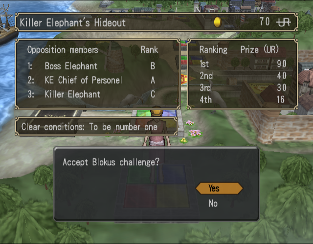
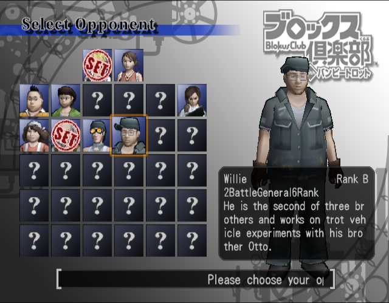
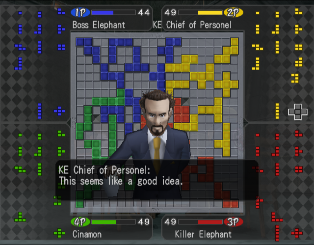

# Blokus-Club-with-Bumpy-Trot-PS2-English-Translation-Patch
An English translation project for Irem's PS2 game Blokus Club with Bumpy Trot. \
All of the text was machine translated with minor editing. \
Some work still needed to be done about text on screen position/spacing. \
Patch is in xdelata format and was tested with MD5: 37f2d3ecbbd4b15cc1af52379a99b66d copy of the game. \

