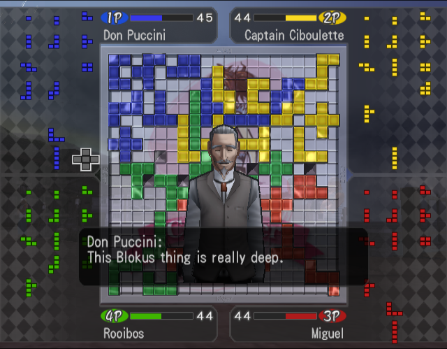
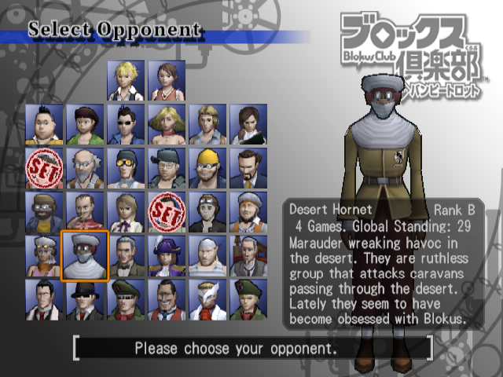
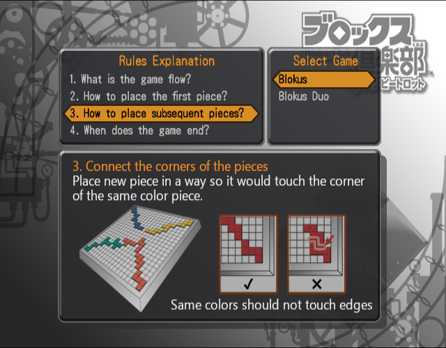

# Blokus-Club-with-Bumpy-Trot-PS2-English-Translation-Patch
An English translation patch for Irem's PS2 game Blokus Club with Bumpy Trot. \
All the text and textures were translated from Japanese to English. \
Mostly machine translation with minor editing. And some parts copy-pasted from Steambot Chronicles. \
Patch is in xdelta format and was tested with MD5: 37f2d3ecbbd4b15cc1af52379a99b66d copy of the game. \
Tools used: \
[QuickBMS](https://aluigi.altervista.org/quickbms.htm) - unpacking of .DAT files with disaster_report.bms script. \
[MKPSXISO](https://github.com/Lameguy64/mkpsxiso) - extraction and rebuilding of .BIN image. \
[Delta Patcher](https://github.com/marco-calautti/DeltaPatcher) - creation of patch file. \

